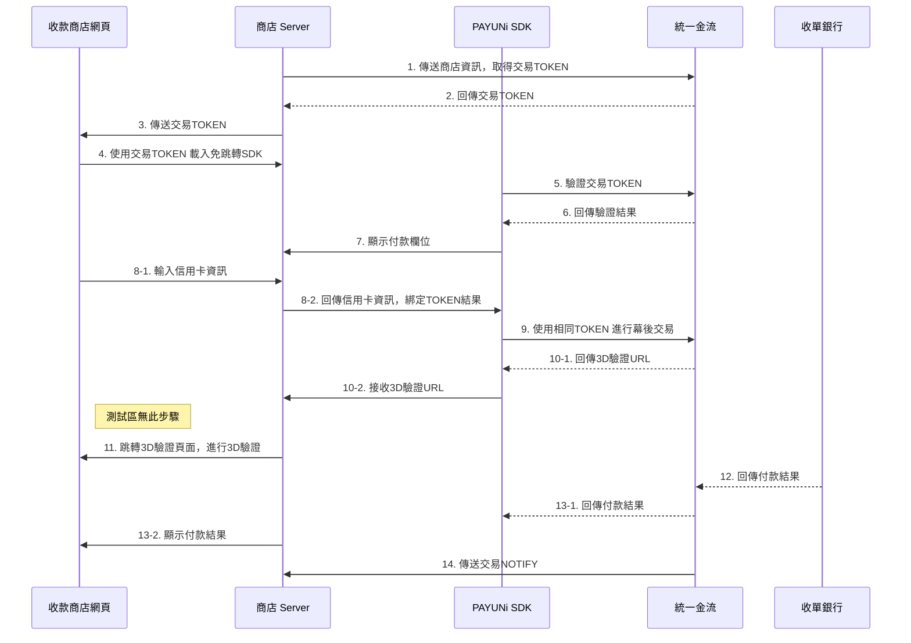
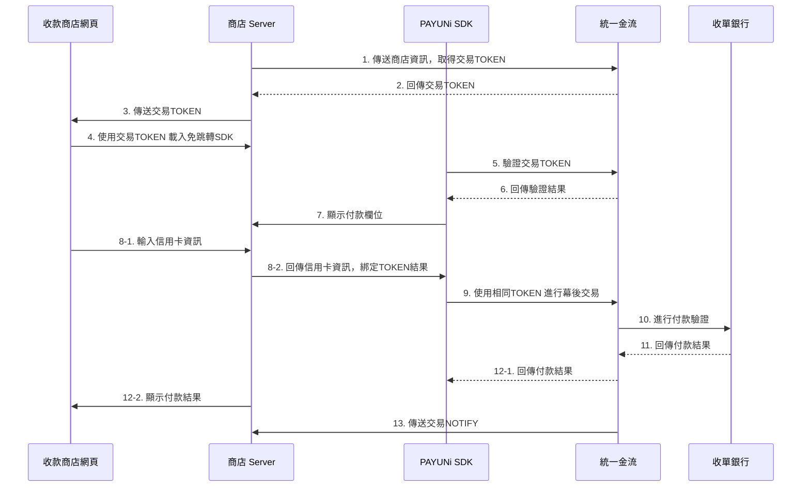

# PAYUNi UNi Embed 免跳轉支付元件

## 架構總覽

```
┌─────────────────┐     ┌──────────────────┐     ┌─────────────────┐
│  前端 Checkout   │     │   WordPress      │     │  PAYUNi API     │
│  (SDK iframe)   │────▶│   Backend (PHP)  │────▶│  Server         │
│                 │◀────│                  │◀────│                 │
└─────────────────┘     └──────────────────┘     └─────────────────┘
   UniPayment SDK        AES-256-GCM 加解密       /iframe/* 端點
   card input iframe     TradeReqHashDTO          交易授權 & 通知
```

## 支付流程

1. **頁面載入** → PHP 後端呼叫 `/iframe/token_get` 取得 SDK Token（有效 10 分鐘）
2. **SDK 初始化** → `UniPayment.createSession(token, options)` 建立 iframe 卡號輸入欄位
3. **填寫卡號** → SDK 即時驗證卡號/到期日/CVC，透過 `onUpdate` 回傳狀態
4. **點擊付款** → 前端呼叫 `getTradeResult()` 取得加密交易資料
5. **提交訂單** → WooCommerce checkout 表單 POST 至後端
6. **後端交易** → PHP 加密參數，呼叫 `/iframe/merchant_trade` 執行授權
7. **3D 驗證**（如適用）→ 導向銀行 3D 頁面，完成後回傳 ReturnURL
8. **非同步通知** → PAYUNi 呼叫 `/wc-api/payuni_notify` 更新訂單狀態
9. **完成** → 前端重導向至 order-received 頁面

## 支付時序圖

> 來源：[免跳轉支付(3D)時序圖](https://docs.payuni.com.tw/Public/Uploads/2025-09-30/68db735a3857e.jpg) / [免跳轉支付(非3D)時序圖](https://docs.payuni.com.tw/Public/Uploads/2025-09-30/68db736011821.jpg)

### 免跳轉支付（3D 驗證）時序圖



```json
{
  "title": "免跳轉支付（3D 驗證）時序圖",
  "participants": [
    { "id": "Merchant", "label": "收款商店網頁" },
    { "id": "Server", "label": "商店 Server" },
    { "id": "SDK", "label": "PAYUNi SDK" },
    { "id": "Gateway", "label": "統一金流" },
    { "id": "Bank", "label": "收單銀行" }
  ],
  "steps": [
    { "step": "1",    "from": "Server",   "to": "Gateway",  "label": "傳送商店資訊，取得交易TOKEN",          "type": "request" },
    { "step": "2",    "from": "Gateway",  "to": "Server",   "label": "回傳交易TOKEN",                      "type": "response" },
    { "step": "3",    "from": "Server",   "to": "Merchant", "label": "傳送交易TOKEN",                      "type": "request" },
    { "step": "4",    "from": "Merchant", "to": "Server",   "label": "使用交易TOKEN 載入免跳轉SDK",          "type": "request" },
    { "step": "5",    "from": "SDK",      "to": "Gateway",  "label": "驗證交易TOKEN",                      "type": "request" },
    { "step": "6",    "from": "Gateway",  "to": "SDK",      "label": "回傳驗證結果",                        "type": "response" },
    { "step": "7",    "from": "SDK",      "to": "Server",   "label": "顯示付款欄位",                        "type": "request" },
    { "step": "8-1",  "from": "Merchant", "to": "Server",   "label": "輸入信用卡資訊",                      "type": "request" },
    { "step": "8-2",  "from": "Server",   "to": "SDK",      "label": "回傳信用卡資訊，綁定TOKEN結果",         "type": "request" },
    { "step": "9",    "from": "SDK",      "to": "Gateway",  "label": "使用相同TOKEN 進行幕後交易",           "type": "request" },
    { "step": "10-1", "from": "Gateway",  "to": "SDK",      "label": "回傳3D驗證URL",                      "type": "response" },
    { "step": "10-2", "from": "SDK",      "to": "Server",   "label": "接收3D驗證URL",                      "type": "request" },
    { "step": "11",   "from": "Server",   "to": "Merchant", "label": "跳轉3D驗證頁面，進行3D驗證",           "type": "request", "note": "測試區無此步驟" },
    { "step": "12",   "from": "Bank",     "to": "Gateway",  "label": "回傳付款結果",                        "type": "response" },
    { "step": "13-1", "from": "Gateway",  "to": "SDK",      "label": "回傳付款結果",                        "type": "response" },
    { "step": "13-2", "from": "Server",   "to": "Merchant", "label": "顯示付款結果",                        "type": "request" },
    { "step": "14",   "from": "Gateway",  "to": "Server",   "label": "傳送交易NOTIFY",                     "type": "async" }
  ]
}
```

### 免跳轉支付（非 3D）時序圖



```json
{
  "title": "免跳轉支付（非 3D）時序圖",
  "participants": [
    { "id": "Merchant", "label": "收款商店網頁" },
    { "id": "Server", "label": "商店 Server" },
    { "id": "SDK", "label": "PAYUNi SDK" },
    { "id": "Gateway", "label": "統一金流" },
    { "id": "Bank", "label": "收單銀行" }
  ],
  "steps": [
    { "step": "1",    "from": "Server",   "to": "Gateway",  "label": "傳送商店資訊，取得交易TOKEN",          "type": "request" },
    { "step": "2",    "from": "Gateway",  "to": "Server",   "label": "回傳交易TOKEN",                      "type": "response" },
    { "step": "3",    "from": "Server",   "to": "Merchant", "label": "傳送交易TOKEN",                      "type": "request" },
    { "step": "4",    "from": "Merchant", "to": "Server",   "label": "使用交易TOKEN 載入免跳轉SDK",          "type": "request" },
    { "step": "5",    "from": "SDK",      "to": "Gateway",  "label": "驗證交易TOKEN",                      "type": "request" },
    { "step": "6",    "from": "Gateway",  "to": "SDK",      "label": "回傳驗證結果",                        "type": "response" },
    { "step": "7",    "from": "SDK",      "to": "Server",   "label": "顯示付款欄位",                        "type": "request" },
    { "step": "8-1",  "from": "Merchant", "to": "Server",   "label": "輸入信用卡資訊",                      "type": "request" },
    { "step": "8-2",  "from": "Server",   "to": "SDK",      "label": "回傳信用卡資訊，綁定TOKEN結果",         "type": "request" },
    { "step": "9",    "from": "SDK",      "to": "Gateway",  "label": "使用相同TOKEN 進行幕後交易",           "type": "request" },
    { "step": "10",   "from": "Gateway",  "to": "Bank",     "label": "進行付款驗證",                        "type": "request" },
    { "step": "11",   "from": "Bank",     "to": "Gateway",  "label": "回傳付款結果",                        "type": "response" },
    { "step": "12-1", "from": "Gateway",  "to": "SDK",      "label": "回傳付款結果",                        "type": "response" },
    { "step": "12-2", "from": "Server",   "to": "Merchant", "label": "顯示付款結果",                        "type": "request" },
    { "step": "13",   "from": "Gateway",  "to": "Server",   "label": "傳送交易NOTIFY",                     "type": "async" }
  ]
}
```

## 環境 URLs

| 環境 | API Base URL | SDK CDN |
|------|-------------|---------|
| Sandbox | `https://sandbox-api.payuni.com.tw/api` | `https://sandbox-vendor.payuni.com.tw/sdk/uni-payment.js` |
| Production | `https://api.payuni.com.tw/api` | `https://vendor.payuni.com.tw/sdk/uni-payment.js` |

| 環境 | 後台 URL |
|------|---------|
| Sandbox | `https://sandbox.payuni.com.tw` |
| Production | `https://www.payuni.com.tw` |

## Reference 導航

| 檔案 | 何時使用 |
|------|---------|
| [sandbox-credentials.md](references/sandbox-credentials.md) | 需要測試卡號或登入沙箱後台時 |
| [api-spec.md](references/api-spec.md) | 查詢 API 端點、參數格式、回應結構時 |
| [encryption.md](references/encryption.md) | 處理加解密邏輯或除錯 Hash 驗證失敗時 |
| [sdk-frontend.md](references/sdk-frontend.md) | 修改前端 checkout 流程、SDK 事件處理時 |
| [tokenization.md](references/tokenization.md) | 開發信用卡記憶/約定扣款功能時 |
| [invoice-carrier.md](references/invoice-carrier.md) | 修改發票載具選項或驗證邏輯時 |
| [error-codes.md](references/error-codes.md) | 除錯交易失敗、查詢錯誤代碼含義時 |

## 專案關鍵檔案

| 檔案路徑 | 說明 |
|---------|------|
| `includes/payuni/src/gateways/CreditV3.php` | WooCommerce 付款閘道主體（Gateway ID: `payuni-credit-v3`） |
| `includes/payuni/v3/Bootstrap.php` | SDK 載入、script 注入、`wp_localize_script` |
| `includes/payuni/v3/Infrastructure/Http/HttpClient.php` | SDK Token 取得、錯誤代碼對照表 |
| `includes/payuni/v3/Infrastructure/Http/TradeHandler.php` | 交易執行、通知處理、訂單狀態更新 |
| `includes/payuni/v3/Contracts/DTOs/TradeReqHashDTO.php` | 交易請求加密參數 DTO |
| `includes/payuni/v3/Contracts/DTOs/TradeReqDTO.php` | 交易請求組裝（含 EncryptInfo/HashInfo） |
| `includes/payuni/v3/Contracts/DTOs/SettingDTO.php` | 環境設定（商店代號、金鑰、模式） |
| `includes/payuni/v3/Shared/Utils/EncryptUtils.php` | AES-256-GCM 加解密 + SHA256 Hash |
| `includes/payuni/v3/Shared/Enums/EMode.php` | TEST / PROD 環境枚舉 |
| `includes/payuni/v3/Shared/Enums/EUseTokenType.php` | 信用卡 Token 類型枚舉 |
| `includes/payuni/v3/Applications/assets/js/PayUniService.module.js` | 前端主服務（SDK 初始化、checkout 流程） |
| `includes/payuni/v3/Applications/assets/js/ApiService.module.js` | 前端 API 通訊（表單提交、交易請求） |
| `includes/payuni/v3/Applications/assets/js/constants.module.js` | 前端常數定義 |
| `includes/payuni/v3/Applications/assets/js/FormState.module.js` | 前端表單驗證狀態管理 |
| `includes/payuni/v3/Applications/assets/js/UIHelper.module.js` | 前端 UI 操作（loading、error、scroll） |
| `includes/payuni/v3/Applications/assets/js/Elements.module.js` | 前端 DOM 管理與 iframe 重渲染 |
| `includes/payuni/v3/Applications/assets/js/utils.module.js` | 前端工具函式 |

## 官方文件（人工參閱）

- [UNi Embed 元件](https://docs.payuni.com.tw/web/#/29/383)
- [信用卡交易](https://docs.payuni.com.tw/web/#/7/29)
- [加解密說明](https://docs.payuni.com.tw/web/#/7/56)
- [信用卡記憶](https://docs.payuni.com.tw/web/#/7/156)

> **注意**：PAYUNi 文件為 SPA 架構，無法直接 fetch 內容。上述連結僅供人工於瀏覽器中開啟參閱。
